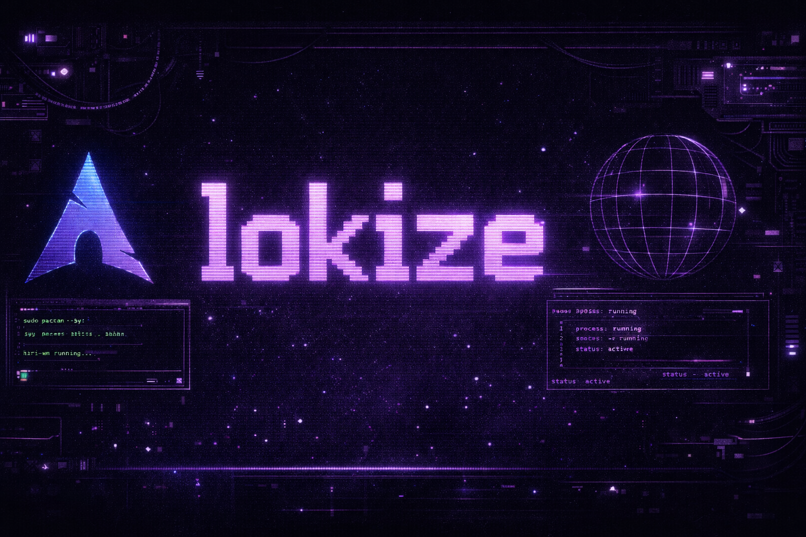

<p align="center">
  
</p>


---

Linux-first development.  
Systems, automation, desktop tooling.

---

## focus

- Linux internals & userland tooling
- background services and automation
- containerized workloads
- OS-integrated desktop utilities
- minimal, scriptable workflows

---

## environment

```text
OS        Arch Linux
Kernel    Linux
Display   Wayland
WM        Niri
Shell     fish
Editor    VS Code
