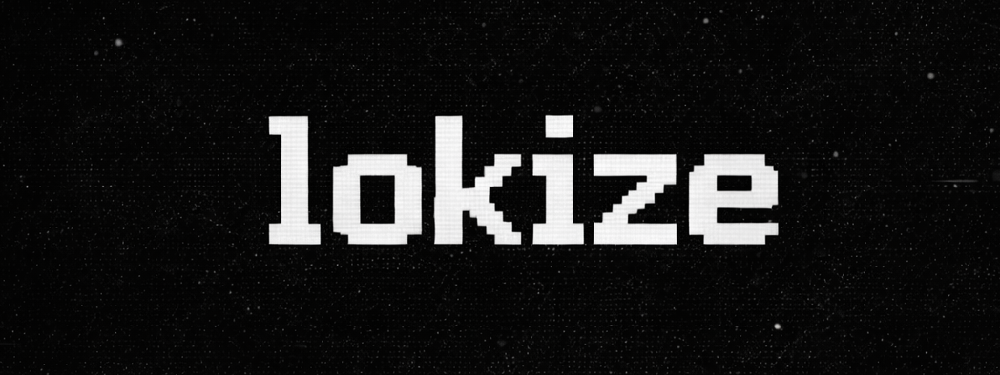

<p align="center">
  
</p>

<p align="center">
  <strong>Linux-first · systems · tooling · automation</strong>
</p>

<h3 align="center">
“For the things we have to learn before we can do them, we learn by doing them.”
<br>
― Aristotle, The Nicomachean Ethics
</h3>

---
<p align="center">


</p>

<p align="center">
  
</p>

---

## system


---

## tooling & runtime


---

## containers & virtualization


---

## cloud & ci/cd


---

## databases


---

## security & networking


---

## scm


---

## about

I build applications and tools focused on **improving real workflows**, not demos.  
Most of what I create starts as something I *personally need* — then evolves through iteration, UI/UX refinement, and automation.

My interests revolve around **systems**, **desktop environments**, **DevOps**, and **infrastructure**.  
I value practicality, clarity, and tools that integrate naturally with the operating system.

> AI is used as assistance — not as a replacement for understanding.

---

## philosophy

Linux-first development.  
Systems over abstractions.  
Tooling that stays out of the way.

If it works, don’t touch it.

---

## focus

- Linux internals & userland tooling
- Backend services & automation
- Containerized workloads
- Cloud-native and self-hosted systems
- OS-integrated desktop utilities
- Improving the tools I use every day
- Mobile apps and tools to improve my productivity
- Open Source
- Game Dev / MMORPG
- Retro & Arcade
- Automation & CLI tools

---

## environment

```text
OS        Arch Linux
Kernel    Linux
Display   Wayland
WM        Niri
Shell     fish
Editor    VS Code
DS        Noctalia Shell
